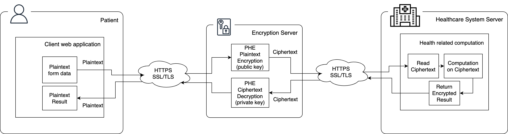
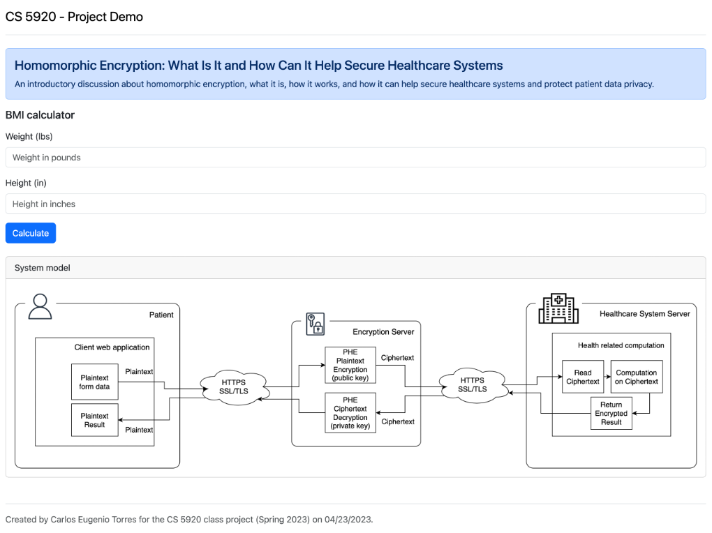

# CS 5920 - Intro to Applied Cryptography

## Class Project

This is final class project of CS 5920 - Intro to Applied to Cryptography attended at [UCCS](https://uccs.edu) for my [PhD in Computer Science program](https://eas.uccs.edu/cs/academics/graduate-programs/phd-in-engineering-concentration-in-computer-science) during the Spring of 2023 and presented on 04/26/2023. This project has:

- A demo (the code on this repo)
- A slide presentation ([CS5920_project_milestone_2_slides.pptx](CS5920_project_milestone_2_slides.pptx))
- A final report paper ([CS5920_project_final_report.pdf](CS5920_project_final_report.pdf))

### Title: Homomorphic Encryption: What Is It and How Can It Help Secure Healthcare Systems

An introductory discussion about homomorphic encryption, what it is, how it works, and how it can help secure healthcare systems and protect patient data privacy.

## System Model



## Demo



On this demo we implemented the Elgamal Cryptosystem Scheme of Partially Homomorphic Encryption and simulate the behavior of a real-world application, where patients send their health information to a healthcare system to be used in some computation and receive the result back. But the healthcare system never can see the plaintext of the patient information and is still able to compute on the ciphertext and return, thanks to the homomorphic properties of this scheme. We implemented two, the encryption server and the healthcare system API server.

- Encryption server (`server_enc` folder):
  
  - Receives the data from the frontend (entered by the end user)
  - Generate public and private keys based on the Elgamal scheme
  - Encrypt the data received
  - Send the encrypted data along with the public key to the healthcare system server
  - Receives the computed result encrypted
  - Decrypt the result using the private key
  - Sends back to the frontend

- Healthcare system (`server_health` folder):
  
  - Receives the ciphertext from the encryption server
  - Compute using the encrypted data received
  - Return the encrypted result to the encryption server

## How to run

Each application (server_enc, server_health) is a `Python Flask` web application. Inside each folder there is a `requirements.txt` file with all Python libraries necessary to be installed to be able to run the applications. 

It is strongly advised to create a virtual environment to be able to run each Flask application properly. Reference can be found [here](https://flask.palletsprojects.com/en/2.3.x/installation/#virtual-environments). To create a `venv`, go to each folder and run:

```sh
python3 -m venv .venv
. venv/bin/activate
```

The run the following command inside each folder to install all requirements:

```sh
pip install -r requirements.txt
```

Once everything is installed you can run the applications. Open two separate terminal windows, go to each folder, and run the following command to start the application:

For `server_enc`

```sh
flask --app app run --port=5050 
```

For `server_health`

```sh
flask --app app run --port=5051 
```

If you need to change the `server_health` port, you need also to update the `HEALTH_API_URL` inside the script `server_enc/he_enc.py`.

Then open <http://localhost:5050> on your browser.

## References

This demo used the following reference to help the implementation of the Elgamal Cryptosystem Scheme in Python:

- Buchanan, William J (2023). ElGamal Homomorphic Multiplication with Python. Asecuritysite.com. https://asecuritysite.com/elgamal/el_homomorphic01

## More information

- Carlos Eugenio Torres 
  - Emails: <carlos.torres@uccs.edu> or <cetorresusa@gmail.com>
  - Website: https://cetorres.com
